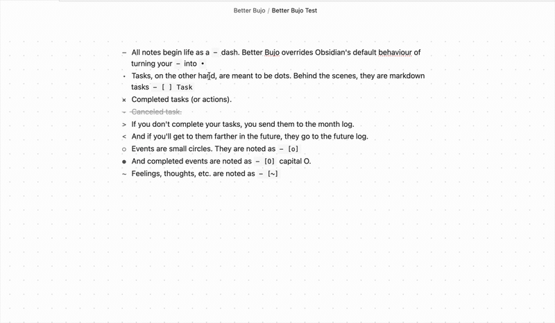

# Better Bujo

Render bullet-journal (BuJo) markers in your notes instead of Obsidian's
checkboxes — in both **Reading mode** and **Live Preview**.

<a href="https://github.com/lumargh/better-bujo/issues?q=is%3Aissue+is%3Aopen+sort%3Areactions-%2B1-desc">Vote on issues</a> · <a href="https://github.com/lumargh/better-bujo/issues/new?labels=bug">Report a bug</a> · <a href="https://github.com/lumargh/better-bujo/issues/new?labels=enhancement">Request a feature</a>

## Markers

At the beginning of a line:

| You type   | Renders as | Meaning                       |
| ---------- | ---------- | ----------------------------- |
| `- item`   | `–`        | Plain note (a dash, not a bullet) |
| `- [ ]`    | `•`        | Open task                     |
| `- [x]`    | `x`        | Done                          |
| `- [>]`    | `>`        | Migrated to the month note    |
| `- [<]`    | `<`        | Sent to the future log        |
| `- [o]`    | `○`        | Event                         |
| `- [O]`    | `●`        | Completed event               |
| `~ ...`    | `~` (styled) | An emotion or a thought     |

## How it works

A regular `-` dash triggers a list, just as normal. A markdown task turns into a `•` bullet. Click it to complete the task. A migrated task looks like `>`, and a task sent to the future log looks like `<`. Events look like a small circle. Click it to complete the circle.

## Known Limitations

This plugin does not work with the Border theme.

## Acknowledgements

Inspired by [obsidian-bujo-bullets](https://github.com/frankolson/obsidian-bujo-bullets) by Frank Olson and Bullet Journaling by Ryder Carroll.

## My other Obsidian plugins

- **[Date List](https://community.obsidian.md/plugins/date-list)** — Returns a list of dates according to the conditions you supply.
- **[Calendar List](https://community.obsidian.md/plugins/calendar-list)** — Insert macOS Calendar events into your notes.
- **[File Filter](https://community.obsidian.md/plugins/file-filter)** — Filter your pages and sidebar by a search term; everything else fades away.
